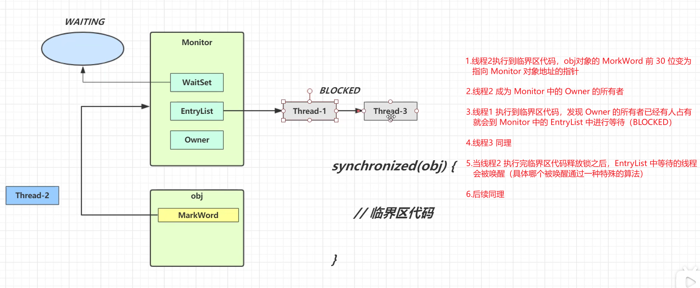
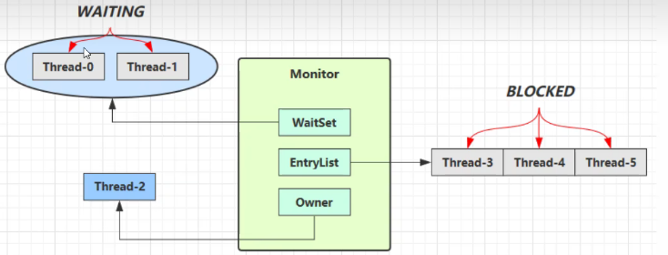
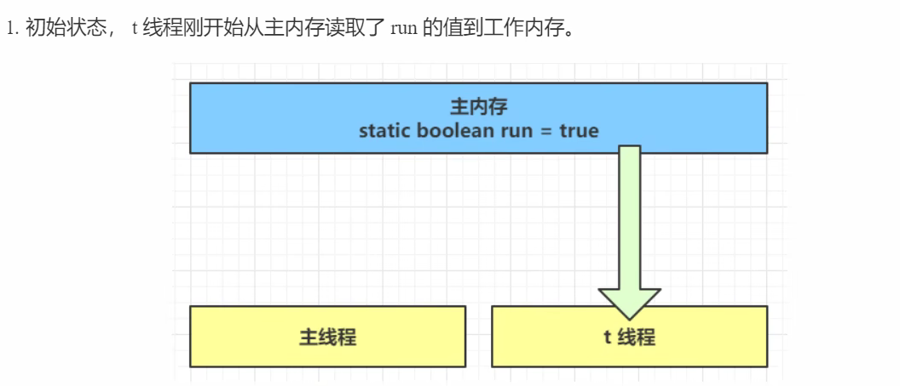
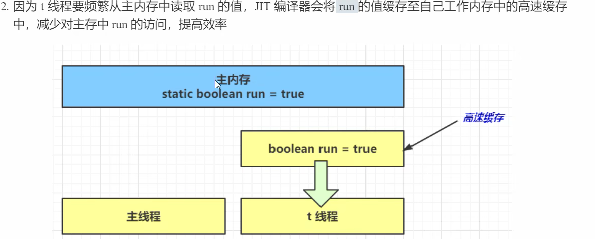
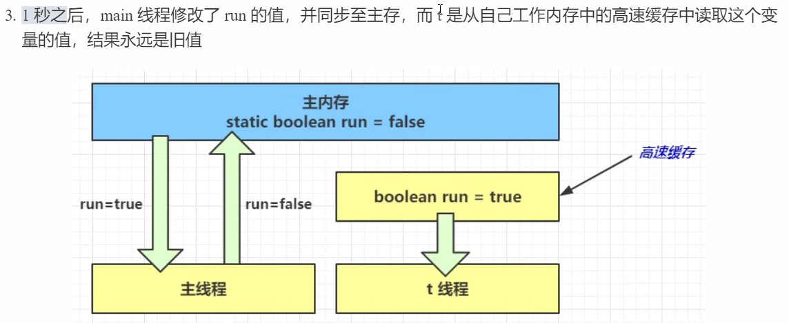
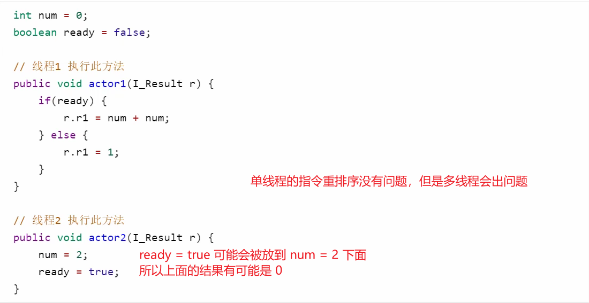
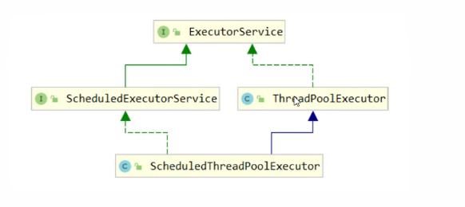

# 基础

## 1.并发和并行

- **并发**指的是：**多个任务在同一段时间内交替执行**。
- **并行**指的是：**多个任务在同一时刻真正同时执行**。

## 2.同步和异步

- **同步**指的是：调用方发起一个任务后，需要等待这个任务执行完成，才能继续往下执行。
- **异步**指的是：调用方发起一个任务后，不需要一直等待任务执行完成，可以继续做其他事情。

## 3.创建线程的方法

```java
@Slf4j(topic = "c.test")
public class test {
    public static void main(String[] args) throws ExecutionException, InterruptedException {
        // 主线程
        log.debug("主线程启动了");

        // 方法1 继承 Thread 重新 run 方法，用调用 start 方法启动线程
        MyThread myThread = new MyThread();
        myThread.start();
        // Lambda 简写
        new Thread(() -> log.debug("线程启动了"), "t1").start();

        // 方法2 - 将任务和线程分离
        // 实现 Runnable 接口，重写 run 方法，传递给 Thread
        Runnable runnable = () -> log.debug("线程启动了");
        new Thread(runnable, "t2").start();
        // 简写
        new Thread(() -> log.debug("线程启动了"), "t3").start();

        // 方法3 - 实现 Callable 接口，重写 call 方法，传递给 Thread
        Callable callable = () -> {
            log.debug("线程启动了");
            Thread.sleep(1000);
            return "Callable";
        };
        FutureTask<String> task = new FutureTask<>(callable);
        new Thread(task, "t4").start();

        log.debug("主线程一秒后得到结果{}", task.get());
    }
}
22:46:28 [main] c.test - 主线程启动了
22:46:28 [Thread-1] c.MyThread - 线程启动了
22:46:28 [t1] c.test - 线程启动了
22:46:28 [t2] c.test - 线程启动了
22:46:28 [t3] c.test - 线程启动了
22:46:28 [t4] c.test - 线程启动了
22:46:29 [main] c.test - 一秒后得到结果Callable
```

## 4.常见方法

| 方法名           | static | 功能说明                                                     | 注意                                                         |
| ---------------- | ------ | ------------------------------------------------------------ | ------------------------------------------------------------ |
| start()          |        | 启动一个新线程，在新的线程运行 run 方法中的代码              | start 方法只是让线程进入就绪，里面代码不一定立刻运行，因为 CPU 的时间片还没分给它。每个线程对象的 start 方法只能调用一次，如果调用多次会出现 IllegalThreadStateException |
| run()            |        | 新线程启动后会调用的方法                                     | 如果在构造 Thread 对象时传递了 Runnable 参数，则线程启动后会调用 Runnable 中的 run 方法，否则默认不执行任何操作。但可以创建 Thread 的子类对象，来覆盖默认行为 |
| join()           |        | 等待线程运行结束                                             |                                                              |
| join(long n)     |        | 等待线程运行结束，最多等待 n 毫秒                            |                                                              |
| getId()          |        | 获取线程长整型的 id                                          | id 唯一                                                      |
| getName()        |        | 获取线程名                                                   |                                                              |
| setName(String)  |        | 修改线程名                                                   |                                                              |
| getPriority()    |        | 获取线程优先级                                               |                                                              |
| setPriority(int) |        | 修改线程优先级                                               | Java 中规定线程优先级是 1~10 的整数，较大的优先级能提高该线程被 CPU 调度的概率 |
| getState()       |        | 获取线程状态                                                 | Java 中线程状态是用 6 个 enum 表示，分别为：NEW、RUNNABLE、BLOCKED、WAITING、TIMED_WAITING、TERMINATED |
| isInterrupted()  |        | 判断线程是否被打断                                           | 不会清除打断标记                                             |
| isAlive()        |        | 判断线程是否存活                                             | 线程还没有运行完毕，就表示存活                               |
| interrupt()      |        | 打断线程                                                     | 如果被打断线程正在 sleep、wait、join，会导致被打断的线程抛出 InterruptedException，并清除打断标记；如果打断的是正在运行的线程，则会设置打断标记；park 的线程被打断，也会设置打断标记 |
| interrupted()    | static | 判断当前线程是否被打断                                       | 会清除打断标记                                               |
| currentThread()  | static | 获取当前正在执行的线程                                       |                                                              |
| sleep(long n)    | static | 让当前执行的线程休眠 n 毫秒，休眠时让出 CPU 的时间片给其他线程 |                                                              |
| yield()          | static | 提示线程调度器让出当前线程对 CPU 的使用                      | 主要是为了测试和调试                                         |

## 5.sleep 和 yield

**sleep**

1. 调用 `sleep` 会让**当前正在执行的线程**进入 `TIMED_WAITING` 状态。

2. `sleep` 需要指定休眠时间，例如： `Thread.sleep(1000); `
3. `sleep` 休眠期间会让出 CPU 时间片，CPU 可以去执行其他线程。
4. `sleep` **不会释放**当前线程已经持有的锁。
5. 如果线程在 `sleep` 期间被其他线程调用 `interrupt()` 打断，会抛出 `InterruptedException`。
6. `sleep` 时间到了以后，线程不会立刻执行，而是重新进入就绪状态，等待 CPU 调度。
7. `sleep` 是 `Thread` 类的静态方法，推荐写法是：`Thread.sleep(1000);`
8. 实际开发中，`sleep` 常用于模拟耗时、定时等待、控制任务执行频率等场景。

**yield**

1. 调用 `yield` 会让当前线程从运行状态重新回到 `RUNNABLE` 状态。
2. `yield` 的作用是提示线程调度器：当前线程愿意让出 CPU。
3. `yield` 只是一个提示，不保证当前线程一定会暂停。
4. 调用 `yield` 后，当前线程仍然可能马上再次被 CPU 调度执行。
5. `yield` 不需要指定等待时间。
6. `yield` **不会释放**当前线程已经持有的锁。
7. `yield` 不会抛出 `InterruptedException`。
8. `yield` 是 `Thread` 类的静态方法，写法是：`Thread.yield();`

**总结：**

- sleep：当前线程睡一会儿，到时间后再参与 CPU 竞争。

- yield：当前线程让一下 CPU，但不保证真的让成功。

## 6.线程优先级

setPriority(int)

- 在线程空闲时作用不大

## 7.interrupt

```java
public static void main(String[] args) throws InterruptedException {
    Thread t1 = new Thread(() -> {
        log.debug("开始执行");
        try {
            Thread.sleep(5000);
        } catch (InterruptedException e) {
            log.debug(" interrupted");
        }
    }, "t1");
    t1.start();
    Thread.sleep(1000);
    // 打断正在 sleep join wait 的线程，会抛出 InterruptedException 并清除打断标记
    t1.interrupt();
    log.debug("t1 打断标记：{}", t1.isInterrupted());
    Thread t2 = new Thread(() -> {
        log.debug("开始执行");
        while (true) {
            boolean interrupted = Thread.currentThread().isInterrupted();
            if (interrupted) {
                log.debug("料理后事.....");
                log.debug("被打断，退出循环");
                break;
            }
        }
    }, "t2");
    t2.start();
    Thread.sleep(1000);
    // 打断正在运行的线程不会抛出（不会让线程停止） InterruptedException 也不会清除打断标记
    t2.interrupt();
    log.debug("t2 打断标记：{}", t2.isInterrupted());
}
09:36:18 [t1] c.interruptTest - 开始执行
09:36:19 [t1] c.interruptTest -  interrupted
09:36:19 [main] c.interruptTest - t1 打断标记：false
09:36:19 [t2] c.interruptTest - 开始执行
09:36:20 [t2] c.interruptTest - 料理后事.....
09:36:20 [t2] c.interruptTest - 被打断，退出循环
09:36:20 [main] c.interruptTest - t2 打断标记：true
```

## 8.打断 park 线程

```java
public static void main(String[] args) throws InterruptedException {
    Thread t1 = new Thread(() -> {
        log.debug("开始执行...");
        LockSupport.park();
        log.debug("被唤醒...");
        // log.debug("打断状态：{}", Thread.currentThread().isInterrupted());
        log.debug("打断状态：{}", Thread.interrupted());
        // 再次 park 不会停止，因为打断标记已经存在
        // 解决方法：在 park 之前清除打断标记 ， 使用 Thread.interrupted() 方法
        LockSupport.park();
        log.debug("被唤醒...");
    }, "t1");
    t1.start();
    Thread.sleep(2000);
    t1.interrupt();
}
13:54:58 [t1] c.parkTest - 开始执行...
13:55:00 [t1] c.parkTest - 被唤醒...
13:55:00 [t1] c.parkTest - 打断状态：true
阻塞................
```

## 9.守护线程

```java
public static void main(String[] args) {
    Thread t1 = new Thread(() -> {
        while (true) {
            log.debug("t1 is running");
        }
    }, "t1");
    // 如果不设置为守护线程，t1线程会一直运行，导致main线程无法退出
    // 必须在 start 之前调用
    t1.setDaemon(true);
    t1.start();
    log.debug("main is exiting");
}
```

**常见的守护线程：**

- 垃圾回收线程
- 引用清理 / 信号调度线程

## 10.线程状态

**从 Java API 层面说**

**根据 Thread .State 枚举，分为六种状态**

| 英文状态        | 含义                                                   | 常见进入方式                                                 | 常见退出方式                                                 |
| --------------- | ------------------------------------------------------ | ------------------------------------------------------------ | ------------------------------------------------------------ |
| `NEW`           | 线程对象已经创建，但还没有调用 `start()` 方法          | `Thread t = new Thread()`                                    | 调用 `t.start()` 后进入 `RUNNABLE`                           |
| `RUNNABLE`      | 线程已经启动，可能正在运行，也可能在等待 CPU 时间片    | 调用 `start()`；从阻塞、等待、超时等待中恢复                 | 竞争锁失败进入 `BLOCKED`；调用等待方法进入 `WAITING/TIMED_WAITING`；执行结束进入 `TERMINATED` |
| `BLOCKED`       | 线程正在等待获取对象监视器锁，也就是 `synchronized` 锁 | 进入 `synchronized` 代码块或方法时，锁被其他线程占用         | 获取到锁后进入 `RUNNABLE`                                    |
| `WAITING`       | 线程无限期等待，需要其他线程显式唤醒                   | `Object.wait()`；`Thread.join()`；`LockSupport.park()`       | 被 `notify()` / `notifyAll()` 唤醒；被等待线程结束；`unpark()`；中断 |
| `TIMED_WAITING` | 线程在指定时间内等待，到时间后自动恢复                 | `Thread.sleep(ms)`；`Object.wait(ms)`；`Thread.join(ms)`；`LockSupport.parkNanos()`；`parkUntil()` | 时间到；被唤醒；被中断                                       |
| `TERMINATED`    | 线程执行完毕或异常结束                                 | `run()` 方法执行结束；线程抛出未捕获异常                     | 不能再转换为其他状态                                         |

| 当前状态        | 触发条件                                         | 转换后的状态    |
| --------------- | ------------------------------------------------ | --------------- |
| `NEW`           | 调用 `start()`                                   | `RUNNABLE`      |
| `RUNNABLE`      | 抢不到 `synchronized` 锁                         | `BLOCKED`       |
| `BLOCKED`       | 获取到 `synchronized` 锁                         | `RUNNABLE`      |
| `RUNNABLE`      | 调用 `Object.wait()`                             | `WAITING`       |
| `RUNNABLE`      | 调用无参 `Thread.join()`                         | `WAITING`       |
| `RUNNABLE`      | 调用 `LockSupport.park()`                        | `WAITING`       |
| `WAITING`       | 被 `notify()` / `notifyAll()` 唤醒，并重新拿到锁 | `RUNNABLE`      |
| `WAITING`       | `join()` 等待的线程执行结束                      | `RUNNABLE`      |
| `WAITING`       | 被 `LockSupport.unpark()` 唤醒                   | `RUNNABLE`      |
| `RUNNABLE`      | 调用 `Thread.sleep(time)`                        | `TIMED_WAITING` |
| `RUNNABLE`      | 调用 `Object.wait(time)`                         | `TIMED_WAITING` |
| `RUNNABLE`      | 调用 `Thread.join(time)`                         | `TIMED_WAITING` |
| `RUNNABLE`      | 调用 `LockSupport.parkNanos()` / `parkUntil()`   | `TIMED_WAITING` |
| `TIMED_WAITING` | 等待时间到                                       | `RUNNABLE`      |
| `TIMED_WAITING` | 被唤醒或中断                                     | `RUNNABLE`      |
| `RUNNABLE`      | `run()` 方法执行完毕                             | `TERMINATED`    |
| `RUNNABLE`      | 抛出未捕获异常                                   | `TERMINATED`    |

| 易混点                             | 说明                                                         |
| ---------------------------------- | ------------------------------------------------------------ |
| `RUNNABLE` 不一定真的在运行        | Java 中没有单独的 `RUNNING` 状态，正在运行和等待 CPU 时间片都属于 `RUNNABLE` |
| `BLOCKED` 只针对 `synchronized` 锁 | 等待 `ReentrantLock` 一般不是 `BLOCKED`，通常表现为 `WAITING` |
| `sleep()` 不会释放锁               | 当前线程睡眠，但如果它持有 `synchronized` 锁，不会释放       |
| `wait()` 会释放锁                  | 调用 `wait()` 后，线程会释放当前对象的监视器锁               |
| `notify()` 后不是立刻运行          | 被唤醒的线程还要重新竞争锁，拿到锁后才会进入 `RUNNABLE`      |
| `TERMINATED` 后不能重新启动        | 一个线程对象只能调用一次 `start()`，结束后不能再次启动       |

| 方法                      | 进入状态        | 是否释放锁             | 是否需要被唤醒                       | 说明                           |
| ------------------------- | --------------- | ---------------------- | ------------------------------------ | ------------------------------ |
| `Thread.sleep(time)`      | `TIMED_WAITING` | 不释放锁               | 不需要，时间到自动恢复               | 让当前线程睡眠指定时间         |
| `Object.wait()`           | `WAITING`       | 释放锁                 | 需要 `notify()` / `notifyAll()` 唤醒 | 必须在 `synchronized` 中使用   |
| `Object.wait(time)`       | `TIMED_WAITING` | 释放锁                 | 可以被唤醒，也可以时间到自动恢复     | 带超时时间的等待               |
| `Thread.join()`           | `WAITING`       | 不释放当前持有的普通锁 | 等待目标线程结束                     | 当前线程等待另一个线程执行完成 |
| `Thread.join(time)`       | `TIMED_WAITING` | 不释放当前持有的普通锁 | 目标线程结束或时间到                 | 带超时时间的线程等待           |
| `LockSupport.park()`      | `WAITING`       | 不释放锁               | 需要 `unpark()` 唤醒                 | 常用于 JUC 并发工具底层        |
| `LockSupport.parkNanos()` | `TIMED_WAITING` | 不释放锁               | 可以被 `unpark()` 唤醒，也可以时间到 | 纳秒级超时等待                 |

| 问题                                   | 答案                                                         |
| -------------------------------------- | ------------------------------------------------------------ |
| Java 线程有几种状态？                  | 6 种：`NEW`、`RUNNABLE`、`BLOCKED`、`WAITING`、`TIMED_WAITING`、`TERMINATED` |
| Java 中有 `RUNNING` 状态吗？           | 没有。正在运行和等待 CPU 调度都属于 `RUNNABLE`               |
| `BLOCKED` 和 `WAITING` 有什么区别？    | `BLOCKED` 是等待 `synchronized` 锁；`WAITING` 是主动进入无限期等待，需要其他线程唤醒 |
| `sleep()` 和 `wait()` 最大区别是什么？ | `sleep()` 不释放锁；`wait()` 会释放锁                        |
| `notify()` 后线程会马上运行吗？        | 不会。被唤醒后还要重新竞争锁，拿到锁后才可能运行             |
| `start()` 后线程一定立刻执行吗？       | 不一定。调用 `start()` 后线程进入 `RUNNABLE`，是否立刻执行取决于 CPU 调度 |
| 线程结束后还能再次调用 `start()` 吗？  | 不能。线程一旦进入 `TERMINATED`，再次调用 `start()` 会抛出 `IllegalThreadStateException` |

# synchronized

## 1.加在不同位置

```java
// 加在成员方法上，相当于锁住的是当前的 this 对象
public synchronized void increment() {
    count++;
}

// 加在静态方法上，相当于锁住的是当前类的对象 xxx.class
public static synchronized void increment() {
    count++;
}
```

## 2.常见线程安全类

String 	Integer	StringBuffer	Random	HashTable	juc包下的类

- 多个线程调用他们同一个实例的某个方法时，是线程安全的
- 它们的每个方法是原子的
- 但是多个方法组合起来不一定线程安全

## 3.Java对象头

**组要组成部分：**

Mark Word：存储 hashCode、GC 年龄、锁状态等信息
Klass Pointer：指向类元数据的指针（对象的类型信息）

**注：**数组对象多一个 length 数组长度（4个字节）

**普通对象**

| JVM 情况                  | Mark Word | Klass Pointer | 对象头大小      |
| ------------------------- | --------- | ------------- | --------------- |
| 32 位 JVM                 | 32 位     | 32 位         | 64 位，8 字节   |
| 64 位 JVM，未开启压缩指针 | 64 位     | 64 位         | 128 位，16 字节 |
| 64 位 JVM，开启压缩指针   | 64 位     | 32 位         | 96 位，12 字节  |

**数组对象**

| JVM 情况                  | Mark Word | Klass Pointer | 数组长度 | 数组对象头大小                      |
| ------------------------- | --------- | ------------- | -------- | ----------------------------------- |
| 32 位 JVM                 | 32 位     | 32 位         | 32 位    | 96 位，12 字节                      |
| 64 位 JVM，未开启压缩指针 | 64 位     | 64 位         | 32 位    | 160 位，20 字节，通常对齐到 24 字节 |
| 64 位 JVM，开启压缩指针   | 64 位     | 32 位         | 32 位    | 128 位，16 字节                     |

**32 位 JVM 中 Mark Word 的结构：**

| 对象状态                          | Mark Word 内容结构                                     |     biased_lock | 锁标志位 | 主要含义                                                     |
| --------------------------------- | ------------------------------------------------------ | --------------: | -------: | ------------------------------------------------------------ |
| Normal / 无锁状态                 | `hashcode:25 \| age:4 \| biased_lock:0 \| 01`          | 0（不是偏向锁） |       01 | 普通无锁对象，Mark Word 中可以存储对象的 hashCode、GC 年龄等信息 |
| Biased / 偏向锁状态               | `thread:23 \| epoch:2 \| age:4 \| biased_lock:1 \| 01` |   1（是偏向锁） |       01 | 对象偏向某个线程，Mark Word 中存储偏向线程 ID、epoch、GC 年龄等 |
| Lightweight Locked / 轻量级锁状态 | `ptr_to_lock_record:30 \| 00`                          |               - |       00 | Mark Word 中存储指向线程栈中 Lock Record 的指针              |
| Heavyweight Locked / 重量级锁状态 | `ptr_to_heavyweight_monitor:30 \| 10`                  |               - |       10 | Mark Word 中存储指向 ObjectMonitor 的指针                    |
| Marked for GC / GC 标记状态       | `空:30 \| 11`                                          |               - |       11 | 对象被 GC 标记，表示与垃圾回收相关的特殊状态                 |

## 4.Monitor 原理



```java
static final Object lock = new Object();
static int counter = 0;
public static void main(String[] args) throws InterruptedException {
    synchronized (lock) {
        counter++;
    }
}
```

```class
Compiled from "test1.java"
public class com.tsw.bsynchronized.test1 {
  static final java.lang.Object lock;

  static int counter;

  public com.tsw.bsynchronized.test1();
    Code:
       0: aload_0
       1: invokespecial #1                  // Method java/lang/Object."<init>":()V
       4: return

  public static void main(java.lang.String[]) throws java.lang.InterruptedException;
    Code:
       0: getstatic     #2                  // Field lock:Ljava/lang/Object;  得到 lock 的引用
       3: dup								// 复制 lock 的引用
       4: astore_1							// 将 lock 的引用赋值给 slot1
       5: monitorenter						// 将 Mark Word 指向 Monitor
       
       6: getstatic     #3                  // Field counter:I   准备变量
       9: iconst_1							// 准备常量 1
      10: iadd								// 加1
      11: putstatic     #3                  // Field counter:I	赋值给变量
      
      14: aload_1							// 拿到 slot1 中的 lock 引用地址
      15: monitorexit						// 解锁，将 lock 对象中的 MarkWord 重置，唤醒 EntryList 
      16: goto          24					// 到24行 return
      
      19: astore_2							// 将异常变量存储到 slot2
      20: aload_1							// 拿到 slot1 中的 lock 引用地址
      21: monitorexit						// 解锁，将 lock 对象中的 MarkWord 重置，唤醒 EntryList
      22: aload_2							// 拿到异常对象
      23: athrow							// throw e
      
      24: return
    Exception table:
       from    to  target type
           6    16    19   any		// 6-19行如果出现异常，将会执行19行的代码
          19    22    19   any

  static {};
    Code:
       0: new           #4                  // class java/lang/Object
       3: dup
       4: invokespecial #1                  // Method java/lang/Object."<init>":()V
       7: putstatic     #2                  // Field lock:Ljava/lang/Object;
      10: iconst_0
      11: putstatic     #3                  // Field counter:I
      14: return
}
```

## 5.wait-notify原理



- Owner 线程发现条件不满足，调用 wait 方法，即可进入 WaitSet 变为 WAITING 状态
- BLOCKED 和 WAITING 的线程都处于阻塞状态，**不占用 CPU 时间片**
- BLOCKED 线程会在 Owner 线程释放锁时唤醒
- WAITING 线程会在 Owner 线程调用 notify 或 notifyAll 时唤醒，但唤醒后并不意味者立刻获得锁，仍需进入 EntryList 重新竞争

## 6.join 原理（保护性暂停）

```java
public final synchronized void join(long millis)
throws InterruptedException {
    long base = System.currentTimeMillis();
    // 经历时间
    long now = 0;
    if (millis < 0) {
        throw new IllegalArgumentException("timeout value is
    }
    if (millis == 0) {
        while (isAlive()) {
            wait(0);
        }
    } else {
        while (isAlive()) {
            // 经历时间大于等待时间就退出
            long delay = millis - now;
            if (delay <= 0) {
                break;
            }
            wait(delay);
            now = System.currentTimeMillis() - base;
        }
    }
}
```

## 7.Park & Unpark

**都是 LockSupport 中的静态方法**

```java
@Slf4j(topic = "c.ParkUnpark")
public class ParkUnpark {
    public static void main(String[] args) throws InterruptedException {
        Thread t1 = new Thread(() -> {
            log.debug("start...");
            
            sleep(2000);
            
            log.debug("park...");
            LockSupport.park();
            log.debug("end...");
        }, "t1");
        t1.start();

        // 主线程先 unpark 也可以唤醒这个线程后来的 park
        sleep(1000);
        log.debug("unpark...");
        LockSupport.unpark(t1);
    }
}
21:31:40 [t1] c.ParkUnpark - start...
21:31:41 [main] c.ParkUnpark - unpark...
21:31:42 [t1] c.ParkUnpark - park...
21:31:42 [t1] c.ParkUnpark - end...
```

**特点：**

与 wait-notify 相比

- wait、notify 和 notifyAll 必须配合 Monitor 使用
- park 和 unpark 是以线程为单位来进行 阻塞 和 唤醒 线程，而 noitfy 只能随机唤醒一个线程，noitfyAll 唤醒所有线程，没有那么精确
- park 和 unpark 可以先 unpark ，但是 wait 和 noitfy 不可以先 noitfy 或者 noitfyAll

## 8.死锁

**产生条件：**

- 互斥条件
- 请求与保持条件
- 不可剥夺条件
- 循环等待条件

```java
public class DeadLockDemo {

    private static final Object lockA = new Object();
    private static final Object lockB = new Object();

    public static void main(String[] args) {

        new Thread(() -> {
            synchronized (lockA) {
                System.out.println("线程1拿到了 lockA");

                sleep(500);

                synchronized (lockB) {
                    System.out.println("线程1拿到了 lockB");
                }
            }
        }, "线程1").start();

        new Thread(() -> {
            synchronized (lockB) {
                System.out.println("线程2拿到了 lockB");

                sleep(500);

                synchronized (lockA) {
                    System.out.println("线程2拿到了 lockA");
                }
            }
        }, "线程2").start();
    }
}
```

**避免死锁：**

- 固定加锁顺序（都按先 A 后 B 的顺序）
- 减少锁的嵌套
- 使用 tryLock 设置超时时间
- 一次性申请所有资源
- 避免长时间持有锁

**哲学家就餐问题死锁版本：**

```java
import lombok.extern.slf4j.Slf4j;

import java.util.concurrent.TimeUnit;
import java.util.concurrent.locks.ReentrantLock;

@Slf4j(topic = "c.PhilosopherDemo")
public class PhilosopherDemo {

    public static void main(String[] args) {
        Chopstick c1 = new Chopstick("1号筷子");
        Chopstick c2 = new Chopstick("2号筷子");
        Chopstick c3 = new Chopstick("3号筷子");
        Chopstick c4 = new Chopstick("4号筷子");
        Chopstick c5 = new Chopstick("5号筷子");

        new Philosopher("苏格拉底", c1, c2).start();
        new Philosopher("柏拉图", c2, c3).start();
        new Philosopher("亚里士多德", c3, c4).start();
        new Philosopher("赫拉克利特", c4, c5).start();
        new Philosopher("阿基米德", c5, c1).start();
    }
}

@Slf4j(topic = "c.Philosopher")
class Philosopher extends Thread {

    private final Chopstick left;
    private final Chopstick right;

    public Philosopher(String name, Chopstick left, Chopstick right) {
        super(name);
        this.left = left;
        this.right = right;
    }

    @Override
    public void run() {
        while (true) {
            synchronized (left) {
                log.debug("拿到了左手边的 {}", left.getName());

                synchronized (right) {
                    log.debug("拿到了右手边的 {}", right.getName());
                    eat();
                }
            }
        }
    }

    private void eat() {
        log.debug("正在吃饭...");
        try {
            TimeUnit.SECONDS.sleep(1);
        } catch (InterruptedException e) {
            Thread.currentThread().interrupt();
        }
    }
}

class Chopstick {

    private final String name;

    public Chopstick(String name) {
        this.name = name;
    }

    public String getName() {
        return name;
    }
}
```

## 9.活锁

**概述：**互相改变对方的终止条件，导致谁都结束不了

```java
// 共享变量
static AtomicInteger count = new AtomicInteger(0);

public static void main(String[] args) {
    Thread addThread = new Thread(() -> {
        while (true) {
            // 如果发现 count 是 0，就加 1
            if (count.get() == 0) {
                System.out.println("加线程：发现 count = 0，我加 1");
                count.incrementAndGet();
                sleep(500);
            }
        }
    }, "加线程");
    Thread subThread = new Thread(() -> {
        while (true) {
            // 如果发现 count 是 1，就减 1
            if (count.get() == 1) {
                System.out.println("减线程：发现 count = 1，我减 1");
                count.decrementAndGet();
                sleep(500);
            }
        }
    }, "减线程");
    addThread.start();
    subThread.start();
}
```

## 10.线程饥饿

```java
public static void main(String[] args) {
    Chopstick c1 = new Chopstick("1号筷子");
    Chopstick c2 = new Chopstick("2号筷子");
    Chopstick c3 = new Chopstick("3号筷子");
    Chopstick c4 = new Chopstick("4号筷子");
    Chopstick c5 = new Chopstick("5号筷子");
    new Philosopher("苏格拉底", c1, c2).start();
    new Philosopher("柏拉图", c2, c3).start();
    new Philosopher("亚里士多德", c3, c4).start();
    new Philosopher("赫拉克利特", c4, c5).start();
    // 把最后一个改为顺序执行 不会产生死锁了，但是 阿基米德 会长时间拿不到Cpu的执行权
    new Philosopher("阿基米德", c1, c5).start();
}
```

## 11.ReentrantLock

**特点：**

- 可中断
- 可以设置超时时间
- 可以设置为公平锁
- 支持多个条件变量

与 synchronized 一样都支持可重入

**可中断：**`lockInterruptibly() 方法`

```java
private static ReentrantLock lock = new ReentrantLock();
public static void main(String[] args) throws InterruptedException {
    // 可打断
    Thread t1 = new Thread(() -> {
        try {
            // 如果有竞争没有抢到锁，进入阻塞队列，可以由其他线程用 interrupt() 方法打断
            lock.lockInterruptibly();
        } catch (InterruptedException e) {
            e.printStackTrace();
            log.debug("没有获取到锁，被打断");
            return;
        }
        try {
            log.debug("获取到锁");
        } finally {
            lock.unlock();
        }
    }, "t1");
    log.debug("主线程先获取锁");
    lock.lock();
    
    t1.start();
    
    sleep(2000);
    log.debug("打断 t1 线程");
    
    t1.interrupt();
    lock.unlock();
}
09:04:16 [main] c.ReentrantLock - 主线程先获取锁
09:04:18 [main] c.ReentrantLock - 打断 t1 线程
09:04:18 [t1] c.ReentrantLock - 没有获取到锁，被打断
java.lang.InterruptedException
	
```

**可打断：**`tryLock()` 

```java
private static ReentrantLock lock = new ReentrantLock();
public static void main(String[] args) throws InterruptedException {
    Thread t1 = new Thread(() -> {
        log.debug("尝试获取锁");
        try {
            if (!lock.tryLock(2, TimeUnit.SECONDS)) {
                log.debug("获取锁失败");
                return;
            }
        } catch (InterruptedException e) {
            e.printStackTrace();
            log.debug("没有获取到锁，被打断");
            return;
        }
        try {
            log.debug("获取到锁");
        } finally {
            log.debug("释放锁...");
            lock.unlock();
        }
    }, "t1");
    lock.lock();
    t1.start();
    sleep(3000);
    log.debug("释放锁...");
    lock.unlock();
}
09:10:50 [t1] c.rerntrantLock可超时 - 尝试获取锁
09:10:52 [t1] c.rerntrantLock可超时 - 获取锁失败
09:10:53 [main] c.rerntrantLock可超时 - 释放锁...
```

可以利用 tryLock 和 超时锁 **解决哲学家就餐的死锁问题**

**公平锁：**创建 ReentrantLock 对象是，构造方法传递 true

```java
private static ReentrantLock lock = new ReentrantLock(true);
```

**多个条件变量：**`lock.newCondition()`    	等待：`condition.await();`	   唤醒：`condition.signal()`

```java
private static ReentrantLock lock = new ReentrantLock(true);
public static void main(String[] args) throws InterruptedException {
    Condition condition = lock.newCondition();
    Thread t1 = new Thread(() -> {
        log.debug("尝试获取锁");
        try {
            lock.lock();
            // 获取锁成功，但是条件不满足，等待
            log.debug("条件不满足，等待.....");
            condition.await();
            log.debug("被唤醒，继续执行....");
        } catch (Exception e) {
            e.printStackTrace();
        } finally {
            lock.unlock();
        }
    }, "t1");
    
    t1.start();
    
    sleep(2000);
    log.debug("主线程获取锁，并唤醒t1");
    
    lock.lock();
    condition.signal();
    // condition.signalAll();
    
    log.debug("唤醒完成");
}
09:23:02 [t1] c.rerntrantLock条件变量 - 尝试获取锁
09:23:02 [t1] c.rerntrantLock条件变量 - 条件不满足，等待.....
09:23:04 [main] c.rerntrantLock条件变量 - 主线程获取锁，并唤醒t1
09:23:04 [main] c.rerntrantLock条件变量 - 唤醒完成
```

# 可见性 和 原子性 和 有序性

## 1.可见性 问题 及 原因

```java
static boolean flag = true;
public static void main(String[] args) throws InterruptedException {
    Thread t1 = new Thread(() -> {
        // 程序并不会像预想的停止
        while (flag) {
            // ...
        }
    });
    t1.start();
    Thread.sleep(2000);
    log.debug("停止 t1 线程");
    flag = false;
}
```







## 2.可见性 解决

为变量加上 volatile 关键字。它可以用来修饰静态成员变量和静态成员变量，它可以避免线程从自己的工作缓存中读取变量的值，而是必须到主存中查找，线程操作 volatile 都是直接在主存进行操作

## 3.原子性

volatile 只能解决可见性，保证每次读取的都是主存中的值，但是不能解决原子性。这时候就可以使用 synchronized 来解决 synchronized 既可以保证代码块的 原子性 又可以保证代码块内变量的 可见性

## 4.有序性

CPU底层会对一些不影响最终结果的代码进行指令重排序



## 5.有序性 解决

使用 volatile 

## 6.volatile 如何保证可见性

- 写屏障（sfence）保证在该屏障之前的，对共享变量的改动，都同步到主存当中

- ```java
  public void actor2(I_Result r) {
      num = 2;
      ready = true; // ready 是 volatile 赋值带写屏障
      // 写屏障
  }
  ```

- 而读屏障（lfence）保证在该屏障之后，对共享变量的读取，加载的是主存中最新数据

- ```java
  public void actor1(I_Result r) {
      // 读屏障
      // ready 是 volatile 读取值带读屏障
      if(ready) {
          r.r1 = num + num;
      } else {
          r.r1 = 1;
      }
  }
  ```

## 7.volatile 如何保证有序性

**注：**只能保证线程内的相关代码不被重排序

- 写屏障 会确保指令重排序时，不会将写屏障之前的代码排在写屏障之后

- ```java
  public void actor2(I_Result r) {
      num = 2;
      ready = true; // ready 是 volatile 赋值带写屏障
      // 写屏障
  }
  ```

- 而读屏障 会确保指令重排序时，不会将读屏障之后的代码排在读屏障之前

- ```java
  public void actor1(I_Result r) {
      // 读屏障
      // ready 是 volatile 读取值带读屏障
      if(ready) {
          r.r1 = num + num;
      } else {
          r.r1 = 1;
      }
  }
  ```

## 8.单例模式 双重检查

```java
public class Singleton {

    private static volatile Singleton instance;

    private Singleton() {
    }

    public static Singleton getInstance() {
        if (instance == null) {
            synchronized (Singleton.class) {
                if (instance == null) {
                    instance = new Singleton();
                }
            }
        }
        return instance;
    }
}
1. 分配内存空间						1. 分配内存空间
2. 初始化对象						 2. 把对象地址赋值给 instance        所以要加 volatile
3. 把对象地址赋值给 instance		   3. 初始化对象	
```

# CAS

## 1.AtomicInteger

**主要实现方式：compareAndSet() 方法**   **注意：**还要使用 volatile 修饰来保证可见性

```java
@Override
public void withdraw(Integer money) {
    while (true) {
        // 获取余额最新值
        int prev = balance.get();
        // 修改后的余额
        int next = prev - money;
        // 尝试修改 只有修改时 balance.get() 跟 prev 一样的时候（也就是没有别的线程对 AtomicInteger 进行修改）修改成功
        if (balance.compareAndSet(prev, next)) {
            break;
        }
    }
}
```

```java
@Slf4j(topic = "c.CAS")
public class test {
    public static void main(String[] args) {
        AccountCas account = new AccountCas(10000);
        Account.demo(account);
        account.getBalance();
        log.debug("余额：{}", account.getBalance());
    }
}
class AccountCas implements Account {
    private volatile AtomicInteger balance;

    public AccountCas(int balance) {
        this.balance = new AtomicInteger(balance);
    }

    @Override
    public void withdraw(Integer money) {
        while (true) {
            // 获取余额最新值
            int prev = balance.get();
            // 修改后的余额
            int next = prev - money;
            // 尝试修改 只有 修改时还是 prev 的时候修改成功
            if (balance.compareAndSet(prev, next)) {
                break;
            }
        }
    }

    @Override
    public Integer getBalance() {
        return balance.get();
    }
}
interface Account {
    void withdraw(Integer money);
    Integer getBalance();

    // 测试方法 启动 1000 个线程同时取款
    static void demo (Account account) {
        List<Thread> threads = new ArrayList<>();
        for (int i = 0; i < 1000; i++) {
            threads.add(new Thread(() -> {
                account.withdraw(10);
            }));
        }
        long start = System.currentTimeMillis();
        threads.forEach(Thread::start);
        threads.forEach(thread -> {
            try {
                thread.join();
            } catch (InterruptedException e) {
                e.printStackTrace();
            }
        });
        long end = System.currentTimeMillis();
        System.out.println(end - start);
    }
}
```

## 2.为什么无锁效率高

- 使用锁的时候上下文切换的成本较高

## 3.特点

- 可以结合 volatile 实现无锁并发 ，适用于线程数少、多核CPU的场景下
- CAS 是基于乐观锁的思想：别人修改也没事，重试就好了
- synchronized 是悲观锁
- 如果竞争激烈，重试频繁，性能也会收到影响

## 4.原子整数

```java
public static void main(String[] args) {
    atomicInteger atomicInteger = new AtomicInteger(5);
    /*// 自增并获取 ++i
    log.debug("{}", atomicInteger.incrementAndGet());
    // 获取并自增 i++
    log.debug("{}", atomicInteger.getAndIncrement());
    // 获取并增加
    log.debug("{}", atomicInteger.getAndAdd(5));
    // 增加并获取
    log.debug("{}", atomicInteger.addAndGet(5));*/
    // 获取并更新
    atomicInteger.getAndUpdate(i -> i * 10);
    // 更新并获取
    atomicInteger.updateAndGet(i -> i * 10);
}
```

除了 atomicInteger 还有 AtomicLong、 AtomicBoolean

## 5.原子引用

```java
package com.tsw.CAS;

import lombok.extern.slf4j.Slf4j;

import java.math.BigDecimal;
import java.util.ArrayList;
import java.util.List;
import java.util.concurrent.atomic.AtomicReference;

@Slf4j(topic = "c.原子引用")
public class 原子引用 {
    public static void main(String[] args) {
        DecimalAccount account = new DecimalAccount(new BigDecimal(10000));
        Pay.demo(account);
        log.debug("余额：{}", account.getBalance());
    }
}
class DecimalAccount implements Pay {
    private AtomicReference<BigDecimal> balance;

    public DecimalAccount(BigDecimal balance) {
        this.balance = new AtomicReference<>(balance);
    }

    @Override
    public void withdraw(Integer money) {
        while (true) {
            if (balance.compareAndSet(balance.get(), balance.get().subtract(new BigDecimal(money)))) {
                break;
            }
        }
    }

    @Override
    public BigDecimal getBalance() {
        return balance.get();
    }
}
interface Pay {
    void withdraw(Integer money);
    BigDecimal getBalance();

    // 测试方法 启动 1000 个线程同时取款
    static void demo (Pay account) {
        List<Thread> threads = new ArrayList<>();
        for (int i = 0; i < 1000; i++) {
            threads.add(new Thread(() -> {
                account.withdraw(10);
            }));
        }
        long start = System.currentTimeMillis();
        threads.forEach(Thread::start);
        threads.forEach(thread -> {
            try {
                thread.join();
            } catch (InterruptedException e) {
                e.printStackTrace();
            }
        });
        long end = System.currentTimeMillis();
        System.out.println(end - start);
    }

```

## 6.ABA问题

```java
public class ABA问题 {
    static AtomicReference<String> atomicStampedReference = new AtomicReference<>("A");
    public static void main(String[] args) throws InterruptedException {
        Thread t1 = new Thread(() -> {
            log.debug("change A->B：{}", atomicStampedReference.compareAndSet("A", "B"));
        }, "t1");
        other();
        Thread.sleep(1000);
        t1.start();
    }
    public static void other() {
        new Thread(() -> {
            log.debug("change A->B：{}", atomicStampedReference.compareAndSet("A", "B"));
        }).start();
        new Thread(() -> {
            log.debug("change B->A：{}", atomicStampedReference.compareAndSet("B", "A"));
        }).start();
    }
}
22:27:52 [Thread-2] c.ABA问题 - change B->A：true
22:27:52 [Thread-1] c.ABA问题 - change A->B：true
22:27:53 [t1] c.ABA问题 - change A->B：true
```

**解决ABA问题**：`AtomicStampedReference`

```java
public class 解决ABA问题 {
    static AtomicStampedReference<String> atomicStampedReference = new AtomicStampedReference<>("A", 1);
    public static void main(String[] args) throws InterruptedException {
        log.debug("main start ....");
        String prev = atomicStampedReference.getReference();
        int stamp = atomicStampedReference.getStamp();
        log.debug("版本号：{}", stamp);
        other();
        Thread.sleep(1000);
        log.debug("change A->C：{}", atomicStampedReference.compareAndSet(prev, "C", stamp, stamp + 1));
    }
    public static void other() {
        new Thread(() -> {
            log.debug("change A->B：{}", atomicStampedReference.compareAndSet("A", "B", atomicStampedReference.getStamp(), atomicStampedReference.getStamp() + 1));
            log.debug("change B->A：{}", atomicStampedReference.compareAndSet("B", "A", atomicStampedReference.getStamp(), atomicStampedReference.getStamp() + 1));
        }).start();
    }
}
22:28:42 [main] c.解决ABA问题 - main start ....
22:28:42 [main] c.解决ABA问题 - 版本号：1
    
22:28:42 [Thread-1] c.解决ABA问题 - change A->B：true
22:28:42 [Thread-1] c.解决ABA问题 - change B->A：true
    
22:28:43 [main] c.解决ABA问题 - change A->C：false
```

## 7.原子数组

```java
public class 原子数组 {
    // 原子数组 AtomicIntegerArray AtomicLongArray AtomicReferenceArray
    
    public static void main(String[] args) {
        demo(
                () -> new int[10],
                (array) -> array.length,
                (array, index) -> array[index]++,
                (array) -> System.out.println(Arrays.toString(array))
        );
        
        demo(
                () -> new AtomicIntegerArray(10),
                (array) -> array.length(),
                (array, index) -> array.getAndIncrement(index),
                (array) -> System.out.println(array)
        );
    }
    // supplier 提供者 无中生有 ()->结果 
    // function 函数 一个参数一个结果 （参数）->结果，BiFunction（参数1,参数2）->结果
    // consumer 消费者 一个参数没结果 （参数）->void，BiConsumer（参数1,参数2）->
    private static <T> void demo(
            Supplier<T> arraySupplier,
            Function<T, Integer> lengthFun,
            BiConsumer<T, Integer> putConsumer,
            Consumer<T> printConsumer) {

        List<Thread> ts = new ArrayList<>();
        T array = arraySupplier.get();
        int length = lengthFun.apply(array);

        for (int i = 0; i < length; i++) {
            // 每个线程对数组作 10000 次操作
            ts.add(new Thread(() -> {
                for (int j = 0; j < 10000; j++) {
                    putConsumer.accept(array, j % length);
                }
            }));
        }

        ts.forEach(t -> t.start()); // 启动所有线程
        ts.forEach(t -> {
            try {
                t.join();     // 等所有线程结束
            } catch (InterruptedException e) {
            }
        });
        printConsumer.accept(array);
    }
}
[9004, 8965, 8907, 8935, 9861, 9850, 9840, 9845, 9839, 9855]
[10000, 10000, 10000, 10000, 10000, 10000, 10000, 10000, 10000, 10000]
```

## 8.字段更新器

```java
public class 字段更新器 {
    //字段更新器 AtomicReferenceFieldUpdater AtomicLongFieldUpdater AtomicIntegerFieldUpdater
    public static void main(String[] args) {
        Student s = new Student();

        AtomicReferenceFieldUpdater updater = AtomicReferenceFieldUpdater.newUpdater(Student.class, String.class, "name");
        updater.compareAndSet(s, null, "张三");
        System.out.println(s);
    }
}
class Student{
    volatile String name;

    @Override
    public String toString() {
        return "Student{" +
                "name='" + name + '\'' +
                '}';
    }
}
```

## 9.原子累加器

```java
public class 原子累加器 {
    public static void main(String[] args) {
        demo(
                () -> new AtomicLong(0),
                (adder) -> adder.getAndIncrement()
        );
        demo(
                () -> new LongAdder(),
                (adder) -> adder.increment()
        );
    }
    /*
    () -> 结果      提供累加器对象
    (参数) ->       执行累加操作
    */
    private static <T> void demo(Supplier<T> adderSupplier, Consumer<T> action) {
        T adder = adderSupplier.get();
        List<Thread> ts = new ArrayList<>();
        // 4 个线程，每人累加 50 万
        for (int i = 0; i < 4; i++) {
            ts.add(new Thread(() -> {
                for (int j = 0; j < 500000; j++) {
                    action.accept(adder);
                }
            }));
        }

        long start = System.nanoTime();
        ts.forEach(t -> t.start());
        ts.forEach(t -> {
            try {
                t.join();
            } catch (InterruptedException e) {
            }
        });

        long end = System.nanoTime();
        System.out.println(adder + " cost:" + (end - start) / 1000_000);
    }
}
2000000 cost:33
2000000 cost:12
```

**效率提升原理：**

性能提升的原因很简单，就是在有竞争时，设置多个累加单元，Thread-0 累加 Cell[0]，而 Thread-1 累加 Cell[1]... 最后将结果汇总。这样它们在累加时操作的不同的 Cell 变量，因此减少了 CAS 重试失败，从而提高性能。

## 10.源码-LongAdder

```java
// 累加单元数组，懒惰初始化
transient volatile Cell[] cells;

// 基础值，如果没有竞争，则用 cas 累加这个域
transient volatile long base;

// 在 cells 创建或扩容时，置为 1，表示加锁
transient volatile int cellsBusy;
```

## 11.伪共享

```java
@Contended
static final class Cell {
    volatile long value;

    Cell(long x) {
        value = x;
    }
}
```

伪共享不是多个线程真正共享同一个变量，而是多个线程修改的不同变量位于同一个缓存行中。
CPU 为了保证缓存一致性，会以缓存行为单位进行失效和同步。
因此一个线程修改自己的变量，也会导致其他线程缓存中的同一缓存行失效，
造成频繁的缓存同步，降低性能。
LongAdder 中的 Cell 通过分散热点和缓存行填充来减少 CAS 竞争和伪共享。

## 12.Unsafe

```java
public class TestUnsafe {
    public static void main(String[] args) throws NoSuchMethodException, NoSuchFieldException, IllegalAccessException {
        Field theUnsafe = Unsafe.class.getDeclaredField("theUnsafe");
        theUnsafe.setAccessible(true);
        Unsafe unsafe = (Unsafe) theUnsafe.get(null);
        System.out.println(unsafe);
        // 获取对象属性的偏移量
        long nameOffset = unsafe.objectFieldOffset(Teacher.class.getDeclaredField("name"));
        long idOffset = unsafe.objectFieldOffset(Teacher.class.getDeclaredField("id"));
        
        Teacher t = new Teacher();
        // 执行 cas 操作
        boolean cas = unsafe.compareAndSwapInt(t, idOffset, 0, 1);
        boolean cas1 = unsafe.compareAndSwapObject(t, nameOffset, null, "张三");
        
        // 验证
        System.out.println(t.getName());
        System.out.println(t.getId());
    }
}
@Data
class Teacher {
    volatile String name;
    volatile int id;
}
sun.misc.Unsafe@182decdb
张三
1
```

**自定义原子整数类**

```java
class MyAtomicInteger{
    private volatile int value;
    private static long valueOffset;
    private static final Unsafe UNSAFE;
    static {
        UNSAFE = UnasfeAccessor.getUnsafe();
        try {
            valueOffset = UNSAFE.objectFieldOffset(MyAtomicInteger.class.getDeclaredField("value"));
        } catch (NoSuchFieldException e) {
            throw new RuntimeException(e);
        }
    }
    public MyAtomicInteger(int initialValue) {
        value = initialValue;
    }
    public int getValue() {
        return value;
    }
    public void decrement(int amount) {
        while (true) {
            int prev = value;
            int next = prev - amount;
            if (UNSAFE.compareAndSwapInt(this, valueOffset, prev, next)) {
                break;
            }
        }
    }
}
```

# 不可变类

## 1.概念

String
Integer
Long
BigDecimal
LocalDate
LocalDateTime

**特点：**对象创建完成后，状态不能再变

## 2.享元模式

例如Integer的valueOf方法，-128~127之前返回的是同一个对象

## 3.自定义连接池-享元模式

```java
@Slf4j(topic = "c.自定义连接池")
public class 自定义连接池 {
    public static void main(String[] args) {
        Pool pool = new Pool(2);
        for (int i = 0; i < 3; i++) {
            new Thread(() -> {
                Connection connection = pool.get();
                try {
                    Thread.sleep(1000);
                } catch (InterruptedException e) {
                    throw new RuntimeException(e);
                } finally {
                    pool.free(connection);
                }
            }).start();
        }
    }
}
@Slf4j(topic = "c.Pool")
class Pool {
    // 连接池大小
    private final int poolSize;
    // 连接对象数组
    private Connection[] connections;
    // 表示是否空闲的数组
    private AtomicIntegerArray states;

    public Pool(int poolSize) {
        this.poolSize = poolSize;
        this.connections = new Connection[poolSize];
        this.states = new AtomicIntegerArray(new int[poolSize]);
        for (int i = 0; i < poolSize; i++) {
            connections[i] = new MockConnection("连接" + i);
        }
    }

    // 使用链接
    public Connection get() {
        while (true) {
            for (int i = 0; i < poolSize; i++) {
                if (states.get(i) == 0) {
                    if (states.compareAndSet(i, 0 , 1)) {
                        log.debug("获取连接：{}", connections[i]);
                        return connections[i];
                    }
                }
            }
            // 如果还是没有空闲连接
            synchronized (this) {
                try {
                    log.debug("等待连接对象....");
                    this.wait();
                } catch (InterruptedException e) {
                    e.printStackTrace();
                }
            }
        }
    }
    // 归还连接
    public void free(Connection connection) {
        for (int i = 0; i < poolSize; i++) {
            if (connections[i] == connection) {
                states.set(i, 0);
                synchronized (this) {
                    log.debug("归还连接");
                    this.notify();
                }
            }
        }
    }
}
class MockConnection implements Connection {
    private String name;
    public MockConnection(String name) {
        this.name = name;
    }

    @Override
    public String toString() {
        return "name" + name;
    }
}
13:49:18 [Thread-3] c.Pool - 等待连接对象....
13:49:18 [Thread-1] c.Pool - 获取连接：name连接1
13:49:18 [Thread-2] c.Pool - 获取连接：name连接0
13:49:19 [Thread-2] c.Pool - 归还连接
13:49:19 [Thread-1] c.Pool - 归还连接
13:49:19 [Thread-3] c.Pool - 获取连接：name连接0
13:49:20 [Thread-3] c.Pool - 归还连接
```

# 自定义线程池

```java
package com.tsw.线程池;

import lombok.extern.slf4j.Slf4j;

import java.util.ArrayDeque;
import java.util.Deque;
import java.util.HashSet;
import java.util.LinkedList;
import java.util.concurrent.TimeUnit;
import java.util.concurrent.locks.Condition;
import java.util.concurrent.locks.ReentrantLock;

@Slf4j(topic = "c.自定义线程池")
public class 自定义线程池 {
    public static void main(String[] args) {
        ThreadPool threadPool = new ThreadPool(2, 2, TimeUnit.SECONDS, 1, (queue, task) ->  {
            // 死等
            // queue.put(task);
            // 带超时的等待
            // queue.offer(task, 500, TimeUnit.MICROSECONDS);
            // 放弃
            // log.debug("队列已满放弃....：{}", task);
            // 抛出异常
            // throw new RuntimeException("队列已满，任务执行失败：" + task);
            // 让调用者自己执行
            task.run();
        });
        for (int i = 0; i < 4; i++) {
            int j = i;
            threadPool.execute(() -> {
                try {
                    Thread.sleep(1000);
                } catch (InterruptedException e) {
                    throw new RuntimeException(e);
                }
                log.debug("{}", j);
            });
        }
    }
}
@FunctionalInterface
interface RejectPolicy<T> {
    void rejected(BlockingQueue<T> queue, T task);
}

// 线程池类
@Slf4j(topic = "c.ThreadPool")
class ThreadPool {
    // 任务队列
    private BlockingQueue<Runnable> taskQueue;
    // 线程集合
    private HashSet<Worker> workers = new HashSet<>();
    // 核心线程数
    private int coreSize;
    // 获取任务的超时时间
    private long timeout;
    // 时间单位
    private TimeUnit unit;
    // 拒绝策略
    private RejectPolicy<Runnable> rejectPolicy;

    public ThreadPool(int coreSize, long timeout, TimeUnit unit, int queueCapacity, RejectPolicy<Runnable> rejectPolicy) {
        this.coreSize = coreSize;
        this.timeout = timeout;
        this.unit = unit;
        this.taskQueue = new BlockingQueue<>(queueCapacity);
        this.rejectPolicy = rejectPolicy;
    }

    class Worker extends Thread {
        private Runnable task;
        public Worker(Runnable task) {
            this.task = task;
        }
        @Override
        public void run() {
            // 当 task 不为空，执行任务
            // 当 task 为空，阻塞等待新的任务并执行
            while (task != null || (task = taskQueue.poll(timeout, unit)) != null) {
                try {
                    log.debug("正在执行....：{}", task);
                    task.run();
                }finally {
                    task = null;
                }
            }
            synchronized (workers) {
                log.debug("worker被移除：{}，任务执行结束：{}", this, task);
                workers.remove(this);
            }
        }
    }

    public void execute(Runnable task) {
        // 当任务数没有超过核心线程数时，新来的任务创建一个worker
        // 如果任务数超过核心线程数，新来的任务放到任务队列中
        synchronized (workers) {
            if (workers.size() < coreSize) {
                Worker worker = new Worker(task);
                log.debug("新增worker:{}, 任务对象：{}", worker, task);
                workers.add(worker);
                worker.start();
            } else {
                // 1.队列满了死等
                // taskQueue.put(task);
                // 2.带超时的等待
                // 3.放弃
                // 4.抛出异常
                // 5.让调用者线程执行
                taskQueue.tryPut(rejectPolicy, task);
            }
        }
    }
}
@Slf4j(topic = "c.BlockingQueue")
class BlockingQueue<T>{
    // 1.任务队列
    private Deque<T> queue = new ArrayDeque<>();
    // 2.锁
    private ReentrantLock lock = new ReentrantLock();
    // 3.生产者条件变量
    private Condition fullWaitSet = lock.newCondition();
    // 4.消费者条件变量
    private Condition emptyWaitSet = lock.newCondition();
    // 5.容量
    private int capacity;

    public BlockingQueue(int capacity) {
        this.capacity = capacity;
    }

    // 带超时的阻塞获取
    public T poll(long mills, TimeUnit unit) {
        lock.lock();
        try {
            // 将单位转换成纳秒
            long nanos = unit.toNanos(mills);
            while (queue.isEmpty()) {
                if (nanos <= 0) {
                    return null;
                }
                try {
                    // 返回的是剩余需要等待的时间
                    nanos = emptyWaitSet.awaitNanos(nanos);
                } catch (InterruptedException e) {
                    e.printStackTrace();
                }
            }
            fullWaitSet.signalAll();
            return queue.pollFirst();
        } finally {
            lock.unlock();
        }
    }

    // 阻塞添加
    public void put(T element) {
        lock.lock();
        try {
            while (queue.size() == capacity) {
                try {
                    log.debug("任务队列已满，等待...{}", element);
                    fullWaitSet.await();
                } catch (InterruptedException e) {
                    e.printStackTrace();
                }
            }
            log.debug("任务队列中添加任务：{}", element);
            queue.addLast(element);
            emptyWaitSet.signalAll();
            return;
        } finally {
            lock.unlock();
        }
    }

    // 带超时的阻塞添加
    public boolean offer(T element, long mills, TimeUnit unit) {
        lock.lock();
        try {
            long nanos = unit.toNanos(mills);
            while (queue.size() == capacity) {
                if (nanos <= 0) {
                    log.debug("等待入队超时，添加任务失败：{}", element);
                    return false;
                }
                try {
                    log.debug("任务队列已满，等待...{}", element);
                    nanos = fullWaitSet.awaitNanos(nanos);
                } catch (InterruptedException e) {
                    e.printStackTrace();
                }
            }
            log.debug("任务队列中添加任务：{}", element);
            queue.addLast(element);
            emptyWaitSet.signalAll();
            return true;
        } finally {
            lock.unlock();
        }
    }

    // 获取大小
    public int size() {
        lock.lock();
        try {
            return queue.size();
        } finally {
            lock.unlock();
        }
    }

    public void tryPut(RejectPolicy<T> rejectPolicy, T task) {
        lock.lock();
        try {
            // 判断队列是否满了
            if (queue.size() == capacity) {
                rejectPolicy.rejected(this, task);
            } else {
                log.debug("任务队列中添加任务：{}", task);
                queue.addLast(task);
                emptyWaitSet.signalAll();
            }
        } finally {
            lock.unlock();
        }
    }
}

```

# ThreadPoolExecutor

## 1.池状态



**ThreadPoolExecutor 使用 int 的高 3 位来表示线程池状态，低 29 位表示线程数量**

| **状态名** | **高 3 位** | **接收新任务** | **处理阻塞队列任务** | **说明**                                  |
| ---------- | ----------- | -------------- | -------------------- | ----------------------------------------- |
| RUNNING    | 111         | Y              | Y                    |                                           |
| SHUTDOWN   | 000         | N              | Y                    | 不会接收新任务，但会处理阻塞队列剩余任务  |
| STOP       | 001         | N              | N                    | 会中断正在执行的任务，并抛弃阻塞队列任务  |
| TIDYING    | 010         | -              | -                    | 任务全执行完毕，活动线程为 0 即将进入终结 |
| TERMINATED | 011         | -              | -                    | 终结状态                                  |

这些信息存储在一个原子变量 `ctl` 中，目的是将线程池状态与线程个数合二为一，这样就可以用一次 cas 原子操作进行赋值

```java
// c 为旧值， ctlOf 返回结果为新值
ctl.compareAndSet(c, ctlOf(targetState, workerCountOf(c))));

// rs 为高 3 位代表线程池状态， wc 为低 29 位代表线程个数， ctl 是合并它们
private static int ctlOf(int rs, int wc) { return rs | wc; }
```

## 2.构造方法

```java
public ThreadPoolExecutor(int corePoolSize,					// 核心线程数
                          int maximumPoolSize,				// 最大线程数	
                          long keepAliveTime,				// 生存时间 - 针对救急线程
                          TimeUnit unit,					// 时间单位 - 针对救急线程
                          BlockingQueue<Runnable> workQueue,// 阻塞队列
                          ThreadFactory threadFactory,		// 线程工厂 - 可以为线程创建时起个好名字
                          RejectedExecutionHandler handler) // 拒绝策略
```

## 3.工作流程和拒绝策略

**工作流程：**

- 线程池中刚开始没有线程，当一个任务提交给线程池后，线程池会创建一个新线程来执行任务。
- 当线程数达到 **corePoolSize** 并没有线程空闲，这时再加入任务，新加的任务会被加入 **workQueue** 队列排队，直到有空闲的线程。
- 如果队列选择了有界队列，那么任务超过了队列大小时，会创建 **maximumPoolSize - corePoolSize** 数目的线程来救急（即救急线程）。
- 如果线程到达 **maximumPoolSize** 仍然有新任务，这时会执行**拒绝策略**。

**拒绝策略：**

- **AbortPolicy**：让调用者抛出 `RejectedExecutionException` 异常，这是**默认策略**。
- **CallerRunsPolicy**：让调用者（提交任务的线程）运行任务。
- **DiscardPolicy**：放弃本次任务。
- **DiscardOldestPolicy**：放弃队列中最早的任务，本任务取而代之。
- **Dubbo 的实现**：在抛出 `RejectedExecutionException` 异常之前会记录日志，并 dump 线程栈信息，方便定位问题。
- **Netty 的实现**：是创建一个新线程来执行任务。
- **ActiveMQ 的实现**：带超时等待（60s）尝试放入队列，类似之前自定义的拒绝策略。
- **PinPoint 的实现**：它使用了一个拒绝策略链，会逐一尝试策略链中每种拒绝策略。

**线程回收机制：**

- 当高峰过去后，超过 **corePoolSize** 的救急线程如果一段时间没有任务做，需要结束以节省资源，这个时间由 **keepAliveTime** 和 **unit** 来控制。

## 4.固定大小线程池newFixedThreadPool

```java
public static ExecutorService newFixedThreadPool(int nThreads) {
    return new ThreadPoolExecutor(nThreads, nThreads,
                                  0L, TimeUnit.MILLISECONDS,
                                  new LinkedBlockingQueue<Runnable>());
}
```

**特点：**

- **核心线程数 == 最大线程数**（没有救急线程被创建），因此也无需超时时间。
- **阻塞队列是无界的**，可以放任意数量的任务。

**场景：**

- 适用于任务量已知，相对耗时的任务。

## 5.带缓冲的线程池newCachedThreadPool

```java
public static ExecutorService newCachedThreadPool() {
    return new ThreadPoolExecutor(0, Integer.MAX_VALUE,
                                  60L, TimeUnit.SECONDS,
                                  new SynchronousQueue<Runnable>());
}
```

- 核心线程数是 `0`，最大线程数是 `Integer.MAX_VALUE`，救急线程的空闲生存时间是 `60s`，意味着 
  - 全部都是救急线程（`60s` 后可以回收）  
  - 救急线程可以无限创建  
- 队列采用了 `SynchronousQueue` 实现特点是，它没有容量，没有线程来取是放不进去的（一手交钱、一手交货）

**场景：**

- 整个线程池表现为线程数会根据任务量不断增长，没有上限，当任务执行完毕，空闲1分钟后释放线程。
- 适合任务数比较密集，但每个任务执行时间较短的情况。

## 6.单线程线程池newSingleThreadExecutor

```java
public static ExecutorService newSingleThreadExecutor() {
    return new FinalizableDelegatedExecutorService
        (new ThreadPoolExecutor(1, 1,
                                0L, TimeUnit.MILLISECONDS,
                                new LinkedBlockingQueue<Runnable>()));
}
```

**场景：**

- 希望多个任务排队执行。线程数固定为 1，任务数多于 1 时，会放入无界队列排队。任务执行完毕，这唯一的线程也不会被释放。

**区分：**

- 自己创建一个单线程串行执行任务，如果任务执行失败而终止那么没有任何补救措施，而线程池还会新建一个线程，保证池的正常工作
- `Executors.newSingleThreadExecutor()` 线程个数始终为 1，不能修改
  - `FinalizableDelegatedExecutorService` 应用的是装饰器模式，只对外暴露了 `ExecutorService` 接口，因此不能调用 `ThreadPoolExecutor` 中特有的方法
- `Executors.newFixedThreadPool(1)` 初始时为 1，以后还可以修改
  - 对外暴露的是 `ThreadPoolExecutor` 对象，可以强转后调用 `setCorePoolSize` 等方法进行修改  

## 7.提交任务方法

```java
// 执行任务
void execute(Runnable command);

// 提交任务 task，用返回值 Future 获得任务执行结果
<T> Future<T> submit(Callable<T> task);

// 提交 tasks 中所有任务
<T> List<Future<T>> invokeAll(Collection<? extends Callable<T>> tasks)
        throws InterruptedException;

// 提交 tasks 中所有任务，带超时时间
<T> List<Future<T>> invokeAll(Collection<? extends Callable<T>> tasks,
                              long timeout, TimeUnit unit)
        throws InterruptedException;

// 提交 tasks 中所有任务，哪个任务先成功执行完毕，返回此任务执行结果，其它任务取消
<T> T invokeAny(Collection<? extends Callable<T>> tasks)
        throws InterruptedException, ExecutionException;

// 提交 tasks 中所有任务，哪个任务先成功执行完毕，返回此任务执行结果，其它任务取消，带超时时间
<T> T invokeAny(Collection<? extends Callable<T>> tasks,
                long timeout, TimeUnit unit)
        throws InterruptedException, ExecutionException, TimeoutException;
```

## 8.关闭线程池

**shutdown：**

```java
/*
线程池状态变为 SHUTDOWN
 - 不会接收新任务
 - 但已提交任务会执行完
 - 此方法不会阻塞调用线程的执行
*/
void shutdown();
```

```java
public void shutdown() {
    final ReentrantLock mainLock = this.mainLock;
    mainLock.lock();
    try {
        checkShutdownAccess();
        // 修改线程池状态
        advanceRunState(SHUTDOWN);
        // 仅会打断空闲线程
        interruptIdleWorkers();
        onShutdown(); // 扩展点 ScheduledThreadPoolExecutor
    } finally {
        mainLock.unlock();
    }
    // 尝试终结(没有运行的线程可以立刻终结，如果还有运行的线程也不会等)
    tryTerminate();
}
```

**shutdownNow**

```java
/*
线程池状态变为 STOP
 - 不会接收新任务
 - 会将队列中的任务返回
 - 并用 interrupt 的方式中断正在执行的任务
*/
List<Runnable> shutdownNow();
```

```java
public List<Runnable> shutdownNow() {
    List<Runnable> tasks;
    final ReentrantLock mainLock = this.mainLock;
    mainLock.lock();
    try {
        checkShutdownAccess();
        // 修改线程池状态
        advanceRunState(STOP);
        // 打断所有线程
        interruptWorkers();
        // 获取队列中剩余任务
        tasks = drainQueue();
    } finally {
        mainLock.unlock();
    }
    // 尝试终结
    tryTerminate();
    return tasks;
}
```

# 定时执行

## 1.定时执行-Timer

在「任务调度线程池」功能加入之前，可以使用 `java.util.Timer` 来实现定时功能，Timer 的优点在于简单易用，但由于所有任务都是由同一个线程来调度，因此所有任务都是**串行执行**的，同一时间只能有一个任务在执行，前一个任务的延迟或异常都将会影响到之后的任务。上一个线程有异常会影响后续线程的执行

```java
public static void main(String[] args) {
    Timer timer = new Timer();

    TimerTask task1 = new TimerTask() {
        @Override
        public void run() {
            log.debug("task 1");
            sleep(2);
        }
    };

    TimerTask task2 = new TimerTask() {
        @Override
        public void run() {
            log.debug("task 2");
        }
    };

    // 使用 timer 添加两个任务，希望它们都在 1s 后执行
    // 但由于 timer 内只有一个线程来顺序执行队列中的任务，因此「任务1」的延时，影响了「任务2」的执行
    timer.schedule(task1, 1000);
    timer.schedule(task2, 1000);
}
```

## 2.定时执行-ScheduledThreadPool

**基本使用：**

```java
public static void main(String[] args) {
    ScheduledExecutorService pool = Executors.newScheduledThreadPool(2);
    pool.schedule(() -> {
        log.debug("task 1");
        try {
            Thread.sleep(2000);
        } catch (InterruptedException e) {
            throw new RuntimeException(e);
        }
    }, 1, TimeUnit.SECONDS);
    
    pool.schedule(() -> {
        log.debug("task 2");
    }, 1, TimeUnit.SECONDS);
    
    pool.shutdown();
    // test1();
}
```

**定时重复执行：**

```java
ScheduledExecutorService pool = Executors.newScheduledThreadPool(2);
log.debug("main start...");

// 任务	
pool.scheduleAtFixedRate(() -> {
    log.debug("task 1");
    // 如果这里任务执行时间需要两秒，这个时候任务间隔时间会延长到两秒
}, 1000, 1000, TimeUnit.MILLISECONDS);

10:53:54 [main] c.TestTimer - main start...
10:53:55 [pool-1-thread-1] c.TestTimer - task 1
10:53:56 [pool-1-thread-1] c.TestTimer - task 1
10:53:57 [pool-1-thread-1] c.TestTimer - task 1
10:53:58 [pool-1-thread-1] c.TestTimer - task 1
10:53:59 [pool-1-thread-1] c.TestTimer - task 1
```

```java
ScheduledExecutorService pool = Executors.newScheduledThreadPool(2);
log.debug("main start...");
pool.scheduleWithFixedDelay(() -> {
    log.debug("task 2");
    // 这里任务执行时间两秒，会导致打印间隔变为3秒，因为间隔时间从上一个任务执行完毕后才开始计算
}, 1000, 1000, TimeUnit.MILLISECONDS);
```


# JUC

## 1.AQS原理

**概念：**

- 全称是 **AbstractQueuedSynchronizer**，它是 Java 并发包 `java.util.concurrent.locks` 中非常核心的同步器框架。

AQS 主要用于构建：

- 阻塞式锁
- 同步工具类
- 独占锁
- 共享锁

比如：

```
ReentrantLock
Semaphore
CountDownLatch
ReentrantReadWriteLock
```

**特点：**

**1.使用 `state` 表示同步状态**

- 使用 `state` 表示同步状态

- AQS 内部维护了一个核心变量：

  - ```java
    private volatile int state;
    ```

- 这个 `state` 用来表示资源的状态。

- 不同同步器对 `state` 的含义不同：

- | 工具类                 | state 含义             |
  | ---------------------- | ---------------------- |
  | ReentrantLock          | 表示锁的重入次数       |
  | Semaphore              | 表示剩余许可证数量     |
  | CountDownLatch         | 表示计数器剩余数量     |
  | ReentrantReadWriteLock | 同时表示读锁和写锁状态 |

- AQS 提供了几个操作 `state` 的方法：

  - ```
    getState()
    setState(int newState)
    compareAndSetState(int expect, int update)
    ```

**2.支持独占模式和共享模式**

- AQS 支持两种获取资源的方式。

- **独占模式**

  同一时间只能有一个线程获取资源。

  例如ReentrantLock

  此时只有一个线程能持有锁，其他线程需要等待。

- **共享模式**

  同一时间可以允许多个线程获取资源。

  例如：Semaphore
  	   CountDownLatch
  	   ReadLock

  例如 `Semaphore` 中有 3 个许可证，那么最多允许 3 个线程同时通过。

**3.提供 FIFO 等待队列**

- AQS 内部维护了一个基于 **FIFO** 的等待队列。

  当线程获取锁失败时，会被封装成一个 `Node` 节点，加入等待队列中排队。

  可以简单理解为：`head -> node1 -> node2 -> node3 -> tail`

  先进入队列的线程，通常会更早被唤醒。

  这个队列类似于 Java 对象锁 `Monitor` 里的：`EntryList` 也就是等待获取锁的线程队列。

**4.使用 CAS + LockSupport 实现阻塞和唤醒**

- AQS 获取锁的大致流程是：

  ```
  尝试获取锁
      ↓
  成功：直接执行
      ↓
  失败：加入等待队列
      ↓
  挂起当前线程
      ↓
  前驱节点释放锁后唤醒自己
      ↓
  再次尝试获取锁
  ```

  线程阻塞和唤醒主要依赖：

  ```
  LockSupport.park()
  LockSupport.unpark(thread)
  ```

  所以 AQS 并不是简单地一直自旋，而是获取失败后会进入阻塞状态，避免 CPU 空转。

**5.支持条件变量 Condition**

- `Condition condition = lock.newCondition();`

  常见方法：

  ```
  condition.await();
  condition.signal();
  condition.signalAll();
  ```

  它的作用类似于 `synchronized` 中的：

  ```
  wait()
  notify()
  notifyAll()
  ```

  但是 `Condition` 更灵活，因为一个锁可以创建多个条件变量。

  ```
  Condition notFull = lock.newCondition();
  Condition notEmpty = lock.newCondition();
  ```

**核心思想：**

- AQS 本身并不直接规定“怎么加锁、怎么解锁”。

  它更像是一个半成品框架，帮你处理了：

  ```
  线程排队
  线程阻塞
  线程唤醒
  CAS 修改状态
  同步队列维护
  条件队列维护
  ```

  而具体的获取和释放逻辑，需要子类自己实现。

  常见需要子类实现的方法有：

  ```
  tryAcquire(int arg)
  tryRelease(int arg)
  tryAcquireShared(int arg)
  tryReleaseShared(int arg)
  isHeldExclusively()
  ```

  例如 `ReentrantLock` 会自己定义：

  ```
  state = 0 表示没有线程持有锁
  state > 0 表示锁被持有，并且 state 表示重入次数
  ```

**简化流程：**

以独占锁为例：

```
线程调用 lock()
    ↓
调用 acquire()
    ↓
tryAcquire() 尝试获取锁
    ↓
获取成功：直接返回
    ↓
获取失败：加入 AQS 队列
    ↓
线程 park 阻塞
    ↓
前一个线程释放锁
    ↓
唤醒队列中的后继线程
    ↓
后继线程再次尝试获取锁
```

**总结：**

AQS 是 Java 并发包中构建锁和同步器的基础框架。

它的核心可以总结为：

```
一个 state 状态
两种模式：独占 / 共享
一个 FIFO 同步队列
多个 Condition 条件队列
CAS 保证状态修改安全
LockSupport 实现线程阻塞和唤醒
```

一句话理解：

AQS 帮我们解决了线程排队、阻塞、唤醒这些通用问题，具体什么时候能获取锁、什么时候释放锁，则由子类根据 `state` 自己定义。

## 2.自定义AQS锁

```java
// 自定义锁（不可重入锁）
class MyLock implements Lock {
    // 同步器类
    class MySync extends AbstractQueuedSynchronizer {
        @Override
        protected boolean tryAcquire(int arg) {
            if (compareAndSetState(0, 1)) {
                setExclusiveOwnerThread(Thread.currentThread());
                return true;
            } else {
                return false;
            }
        }
        @Override
        protected boolean tryRelease(int arg) {
            setExclusiveOwnerThread(null);
            setState(0);
            return true;
        }

        @Override
        protected boolean isHeldExclusively() {
            return super.isHeldExclusively();
        }
        public Condition newCondition() {
            return new ConditionObject();
        }
    }
    private MySync sync = new MySync();
    @Override // 加锁（不成功进入阻塞队列等待）
    public void lock() {
        sync.acquire(1);
    }

    @Override // 可打断
    public void lockInterruptibly() throws InterruptedException {
        sync.acquireInterruptibly(1);
    }

    @Override // 尝试加锁
    public boolean tryLock() {
        return sync.tryAcquire(1);
    }

    @Override // 尝试加锁带超时
    public boolean tryLock(long time, TimeUnit unit) throws InterruptedException {
        return sync.tryAcquireNanos(1, unit.toNanos(time));
    }

    @Override // 释放锁
    public void unlock() {
        sync.release(1);
    }

    @Override // 新建条件
    public Condition newCondition() {
        return sync.newCondition();
    }
}
```

## 3.ReentrantLock


