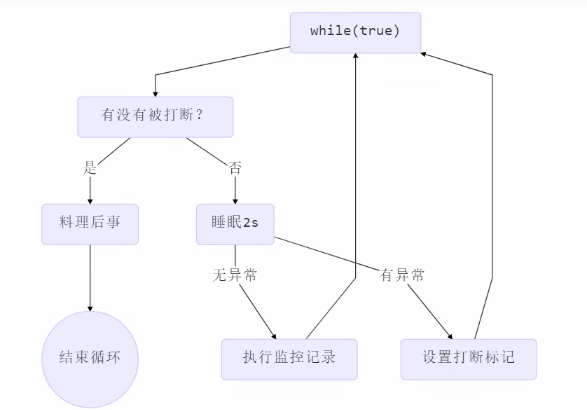

## 两阶段终止模式-interrupt




```java
@Slf4j(topic = "c.两阶段终止模式")
public class 两阶段终止模式 {
    public static void main(String[] args) throws InterruptedException {
        TwoPhaseTermination twoPhaseTermination = new TwoPhaseTermination();
        twoPhaseTermination.start();

        Thread.sleep(5000);

        twoPhaseTermination.stop();
    }
}
@Slf4j(topic = "c.TwoPhaseTermination")
class TwoPhaseTermination {
    private Thread monitorThread;

    public void start() {
        monitorThread = new Thread(() -> {
            while (true) {
                if (Thread.currentThread().isInterrupted()) {
                    log.debug("料理后事...");
                    break;
                }
                try {
                    Thread.sleep(2000); // 情况1：被打断，并清除打断标记
                    log.debug("执行监控..."); // 情况2：正常执行被打算，不会清除打断标记
                } catch (InterruptedException e) {
                    // 重新设置打断标记
                    log.debug("睡眠中被打断，重新设置打断标记");
                    Thread.currentThread().interrupt();
                }
            }
        }, "monitor-thread");
        monitorThread.start();
    }

    public void stop() {
        monitorThread.interrupt();
    }
}
11:51:58 [monitor-thread] c.TwoPhaseTermination - 执行监控...
11:52:00 [monitor-thread] c.TwoPhaseTermination - 执行监控...
11:52:01 [monitor-thread] c.TwoPhaseTermination - 睡眠中被打断，重新设置打断标记
11:52:01 [monitor-thread] c.TwoPhaseTermination - 料理后事...
```

## 保护性暂停-wait/notify

```java
@Slf4j(topic = "c.保护性暂停")
public class 保护性暂停 {
    public static void main(String[] args) {
        // 线程1 等待 线程2 的结果
        GuardedObject guardedObject = new GuardedObject();
        
        Thread t1 = new Thread(() -> {
            log.debug("t1 开始执行....");
            Object response = guardedObject.get();
            log.debug("t1 拿到了结果是：{}", response);
        }, "t1");
        
        Thread t2 = new Thread(() -> {
            log.debug("t2 开始执行");
            try {
                log.debug("t2 等待3秒设置结果");
                Thread.sleep(3000);
            } catch (InterruptedException e) {
                e.printStackTrace();
            }
            log.debug("t2 设置结果");
            guardedObject.set("OK");
            log.debug("t2 结束");
        }, "t2");
        
        t1.start();
        t2.start();
    }
}
@Slf4j(topic = "c.GuardedObject")
class GuardedObject {
    // 结果
    private Object response;

    // 获取结果
    public synchronized Object get() {
        // 使用 while 解决虚假唤醒的问题
        while (response == null) {
            try {
                this.wait();
            } catch (InterruptedException e) {
                e.printStackTrace();
            }
        }
        return response;
    }

    // 设置结果
    public synchronized void set(Object response) {
        this.response = response;
        this.notifyAll();
    }
}
16:53:37 [t1] c.保护性暂停 - t1 开始执行....
16:53:37 [t2] c.保护性暂停 - t2 开始执行
16:53:37 [t2] c.保护性暂停 - t2 等待3秒设置结果
16:53:40 [t2] c.保护性暂停 - t2 设置结果
16:53:40 [t2] c.保护性暂停 - t2 结束
16:53:40 [t1] c.保护性暂停 - t1 拿到了结果是：OK
```

**增加超时效果**

```java
// 获取结果
public synchronized Object get(long timeout) {
    // 开始时间
    long start = System.currentTimeMillis();
    // 等待时间
    long passedTime = 0;
    // 使用 while 解决虚假唤醒的问题
    while (response == null) {
        try {
            if (passedTime > timeout) {
                log.debug("等待超时...");
                break;
            }
            this.wait(timeout - passedTime); // 避免虚假唤醒的时候 等待时间过长
        } catch (InterruptedException e) {
            e.printStackTrace();
        }
        passedTime = System.currentTimeMillis() - start;
    }
    // 有结果被唤醒 返回结果
    return response;
}
17:03:09 [t2] c.保护性暂停 - t2 开始执行
17:03:09 [t1] c.保护性暂停 - t1 开始执行....
17:03:09 [t2] c.保护性暂停 - t2 等待3秒设置结果
17:03:10 [t1] c.GuardedObject - 等待超时...
17:03:10 [t1] c.保护性暂停 - t1 拿到了结果是：null
17:03:12 [t2] c.保护性暂停 - t2 设置结果
17:03:12 [t2] c.保护性暂停 - t2 结束
```

## 一对一送信

```java
package com.tsw.bsynchronized;

import lombok.extern.slf4j.Slf4j;

import java.util.Hashtable;
import java.util.Set;

@Slf4j(topic = "c.一对一")
public class 一对一 {
    public static void main(String[] args) {
        for (int i = 0; i < 5; i++) {
            new Pepole().start();
        }
        Message.getIds().forEach(id -> new Postman(id, "内容" + id).start());
    }
}
@Slf4j(topic = "c.Pepole")
class Pepole extends Thread {
    @Override
    public void run() {
        GuardedObject guardedObject = Message.createGuardedObject();
        log.debug("{}等待获取结果...", guardedObject.getId());
        Object o = guardedObject.get(5000);
        log.debug("{}拿到结果：{}", guardedObject.getId(), o);
    }
}

class Postman extends Thread {
    private Integer id;
    private String content;
    public Postman(Integer id, String content) {
        this.id = id;
        this.content = content;
    }
    @Override
    public void run() {
        GuardedObject guardedObject = Message.removeAndGetGuardedObject(id);
        guardedObject.set(content);
    }
}

class Message {

    static Hashtable<Integer, GuardedObject> guardedObjects = new Hashtable<>();

    private static Integer id = 1;
    
    public static synchronized Integer generateId() {
        return id++;
    }

    public static GuardedObject createGuardedObject() {
        GuardedObject guardedObject = new GuardedObject(generateId());
        guardedObjects.put(guardedObject.getId(), guardedObject);
        return guardedObject;
    }

    public static GuardedObject removeAndGetGuardedObject(int id) {
        return guardedObjects.remove(id);
    }

    public static Set<Integer> getIds() {
        return guardedObjects.keySet();
    }
}

@Slf4j(topic = "c.GuardedObject")
class GuardedObject {
    private Integer id;

    public GuardedObject(Integer id) {
        this.id = id;
    }

    public Integer getId() {
        return id;
    }

    // 结果
    private Object response;

    // 获取结果
    public synchronized Object get(long timeout) {
        // 开始时间
        long start = System.currentTimeMillis();
        // 等待时间
        long passedTime = 0;
        // 使用 while 解决虚假唤醒的问题
        while (response == null) {
            try {
                if (passedTime > timeout) {
                    log.debug("等待超时...");
                    break;
                }
                this.wait(timeout - passedTime); // 避免虚假唤醒的时候 等待时间过长
            } catch (InterruptedException e) {
                e.printStackTrace();
            }
            passedTime = System.currentTimeMillis() - start;
        }
        return response;
    }

    // 设置结果
    public synchronized void set(Object response) {
        this.response = response;
        this.notifyAll();
    }
}
```

## 生产者-消费者

```java
package com.tsw.bsynchronized;

import lombok.Getter;
import lombok.extern.slf4j.Slf4j;

import java.util.LinkedList;
import java.util.Queue;

@Slf4j(topic = "c.生产者消费者")
public class 生产者消费者 {
    public static void main(String[] args) {
        MessageQueue messageQueue = new MessageQueue(4);
        for (int i = 0; i < 5; i++) {
            int id = i;
            new Thread(() -> {
                messageQueue.put(new Message(id, "消息" + id));
            }, "生产者" + i).start();
        }
        new Thread(() -> {
            while (true) {
                try { Thread.sleep(2000); } catch (InterruptedException e) { e.printStackTrace(); }
                messageQueue.get();
            }
        }, "消费者").start();
    }

}
// 消息队列类
@Slf4j(topic = "c.MessageQueue")
class MessageQueue {
    private LinkedList<Message> list = new LinkedList<>();
    // 容量
    private int capacity;
    public MessageQueue(int capacity) {
        this.capacity = capacity;
    }
    // 获取消息
    public Message get() {
        synchronized (list) {
            while (list.isEmpty()) {
                log.debug("队列为空，等待...");
                try {
                    list.wait();
                } catch (InterruptedException e) {
                    e.printStackTrace();
                }
            }
            Message message = list.removeFirst();
            log.debug("消费消息：{}", message.getContent());
            list.notifyAll();
            return message;
        }
    }
    public void put(Message message) {
        synchronized (list) {
            while (list.size() == capacity) {
                log.debug("队列已满，等待...");
                try {
                    list.wait();
                } catch (InterruptedException e) {
                    e.printStackTrace();
                }
            }
            log.debug("队列中有空余生产消息：{}", message.getContent());
            list.addLast(message);
            list.notifyAll();
        }
    }

}
class Message {
    // 只提供 get 方法
    @Getter
    private Integer id;
    @Getter
    private String content;

    public Message(Integer id, String content) {
        this.id = id;
        this.content = content;
    }
}
21:21:51 [生产者1] c.MessageQueue - 队列中有空余生产消息：消息1
21:21:51 [生产者2] c.MessageQueue - 队列中有空余生产消息：消息2
21:21:51 [生产者3] c.MessageQueue - 队列中有空余生产消息：消息3
21:21:51 [生产者0] c.MessageQueue - 队列中有空余生产消息：消息0
21:21:51 [生产者4] c.MessageQueue - 队列已满，等待...
21:21:53 [消费者] c.MessageQueue - 消费消息：消息1
21:21:53 [生产者4] c.MessageQueue - 队列中有空余生产消息：消息4
21:21:55 [消费者] c.MessageQueue - 消费消息：消息2
21:21:57 [消费者] c.MessageQueue - 消费消息：消息3
21:21:59 [消费者] c.MessageQueue - 消费消息：消息0
21:22:01 [消费者] c.MessageQueue - 消费消息：消息4
21:22:03 [消费者] c.MessageQueue - 队列为空，等待...
```